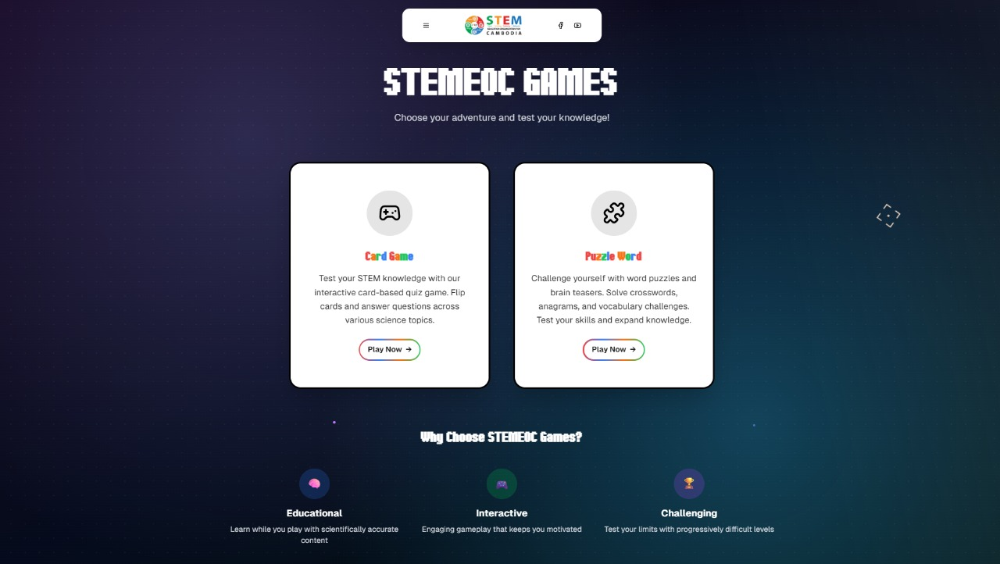

# 🎮 STEMEOC Games

**Interactive Educational Gaming Platform**

STEMEOC Games is a modern, interactive web platform featuring educational games designed to make learning science, technology, engineering, and mathematics fun and engaging. Built with cutting-edge web technologies, this platform offers immersive gaming experiences that combine entertainment with education.

## 🌟 Features

### 🎯 Interactive Games
- **Card Game**: A STEM-focused quiz game with interactive card-flipping mechanics
- **Puzzle Word Game**: Environmental awareness word search puzzles with time challenges

### 🎨 Modern User Experience
- **Custom Target Cursor**: Interactive GSAP-powered cursor with visual feedback
- **Responsive Design**: Optimized for all device sizes
- **Dark Theme**: Eye-friendly dark interface with stunning visual effects
- **Smooth Animations**: GSAP-powered transitions and micro-interactions

### 🌐 Social Integration
- Direct links to STEM Cambodia Facebook page
- YouTube channel integration
- Educational content sharing capabilities

## 🛠️ Technology Stack

### Frontend Framework
- **Next.js 14.2.16** - React-based full-stack framework
- **TypeScript** - Type-safe development
- **React 18** - Modern React with hooks and concurrent features

### Styling & UI
- **Tailwind CSS 4.1.9** - Utility-first CSS framework
- **Radix UI** - Accessible, unstyled UI components
- **Lucide React** - Beautiful, customizable icons
- **Custom CSS Animations** - Handcrafted visual effects

### Animations & Graphics
- **GSAP (GreenSock)** - Professional-grade animations
- **Three.js** - 3D graphics and WebGL rendering
- **React Three Fiber** - React renderer for Three.js
- **PostProcessing** - Advanced visual effects

### Development Tools
- **PostCSS** - CSS processing and optimization
- **Class Variance Authority** - Component variant management
- **Geist Font** - Modern typography

## 🎯 Games Overview

### 🃏 Card Game
An interactive STEM quiz game featuring:
- **Categories**: Environment, Astronomy, Biology, Technology, and more
- **Interactive Cards**: Flip-based reveal mechanics
- **Educational Content**: Science-based questions and explanations
- **Timer System**: Challenge-based gameplay
- **Progress Tracking**: Score and performance monitoring

**Topics Covered:**
- Environmental Science (Trees, Pollution, Ecosystems)
- Astronomy (Seasons, Space exploration)
- Biology (Vaccines, Human body)
- Technology (Modern innovations)

### 🧩 Puzzle Word Game
A fast-paced word search game focusing on environmental awareness:
- **Time Challenge**: 45-second rounds
- **Environmental Themes**: Pollution, Nature, Ecosystems
- **Interactive Grid**: Click-and-drag word selection
- **Visual Feedback**: Found word highlighting and animations
- **Progressive Difficulty**: Multiple challenge levels

**Words Featured:**
- POLLUTION, OZONE, TOXIC, NATURE
- WATER, TRASH, ECOSYSTEM, SOLUTION
- And more environmental terms

## 🎨 Design Features

### Visual Elements
- **Animated Dot Grids**: Dynamic background patterns
- **Gradient Overlays**: Immersive color schemes
- **Retro Aesthetic**: Nostalgic gaming vibes
- **Responsive Cards**: Interactive game selection
- **Custom Typography**: Ithaca serif font for headers

### Interactive Elements
- **Custom Cursor**: Target-style cursor with GSAP animations
- **Hover Effects**: Smooth transitions and transformations
- **Loading States**: Engaging feedback during interactions
- **Progressive Enhancement**: Graceful degradation for accessibility

## 🌍 Educational Impact

STEMEOC Games is designed to:
- **Promote STEM Education** in Cambodia and beyond
- **Make Learning Interactive** through gamification
- **Raise Environmental Awareness** through themed content
- **Support Digital Literacy** with modern web technologies
- **Encourage Critical Thinking** through challenging gameplay

## 🔗 Social Links

- **Facebook**: [STEM Cambodia](https://www.facebook.com/STEMCambodia)
- **YouTube**: [STEM Cambodia Channel](https://www.youtube.com/@StemCambodia)

## 🤝 Contributing

We welcome contributions! Please feel free to submit issues and enhancement requests.

## 📄 License

This project is part of the STEM Education Outreach Cambodia initiative.

---

**Built with ❤️ for STEM Education in Cambodia**

*Making learning fun, one game at a time!*
